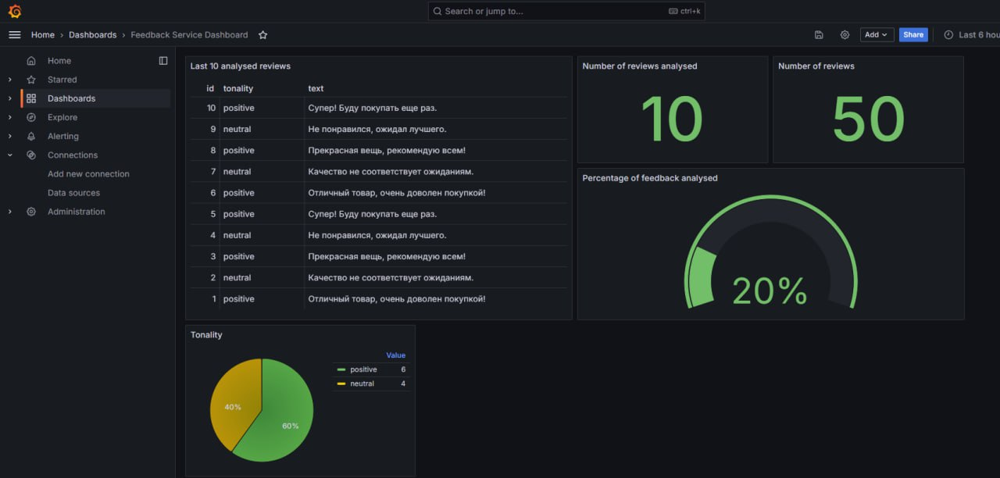

# Feedback Analysis System


Feedback Analysis System is a machine learning-powered application designed to analyze textual feedback and determine its sentiment. The system enables businesses to extract actionable insights from customer reviews, providing a deeper understanding of customer sentiments through visual analytics.

---

## 🚀 Features

- **Sentiment Analysis**: Automatically classify feedback as positive, negative, or neutral.
- **Natural Language Processing (NLP)**: Leverages advanced NLP models to process text effectively.
- **Visualization with Grafana**: Insights and metrics are presented through Grafana dashboards for better interpretability.
- **Customizable Models**: Train and adapt the model for domain-specific feedback.

---

## 📂 Project Structure

```
feedback-analysis-system/
├── data/                 # Datasets used for training and testing
├── models/               # Pretrained and fine-tuned models
├── notebooks/            # Jupyter Notebooks for experiments
├── src/                  # Main application source code
│   ├── preprocessing/    # Text preprocessing scripts
│   ├── analysis/         # Sentiment analysis engine
│   └── visualization/    # Scripts for Grafana integration
├── tests/                # Unit and integration tests
├── requirements.txt      # Dependencies for the project
└── README.md             # Project documentation
```


---

## 🛠️ Installation

1. **Clone the repository**:
   ```bash
   git clone https://github.com/ilya-anashkin/feedback-analysis-system.git
   cd feedback-analysis-system
   ```

2. **Install dependencies**:
   ```bash
   pip install -r requirements.txt
   ```

3. **Run the application**:
   ```bash
   python src/main.py
   ```

4. **Set up Grafana dashboards**:
   Follow the instructions in the `docs/Grafana_Setup.md` to integrate Grafana for visualizing results.

---

## 🎯 Usage

1. **Prepare your feedback dataset**:
   Place your dataset in the `data/` directory in `.csv` format.

2. **Train the model** (optional):
   ```bash
   python src/train_model.py
   ```

3. **Analyze feedback**:
   Run the analysis script and generate metrics.

4. **View results in Grafana**:
   Open the configured Grafana dashboard to explore insights.

---

## 🧠 Model Details

The sentiment analysis model uses transformer-based architectures such as **BERT**, fine-tuned on domain-specific datasets. The system supports custom training for improved performance in specific industries.

---

## 📊 Example Output



---

## 🤝 Contributing

Contributions are welcome! Please follow these steps:

1. Fork the repository.
2. Create a new branch for your feature or bug fix.
3. Submit a pull request with a detailed description of your changes.

## 📧 Contact

If you have any questions or suggestions, feel free to reach out:

- Authors: Ilya Anashkin, Ziyoev Rustam, Musina Alexandra
- GitHub: [ilya-anashkin](https://github.com/ilya-anashkin), [rustamhse](https://github.com/rustamhse), [SashaMusina22](https://github.com/SashaMusina22)

---

Happy analyzing! 🎉
